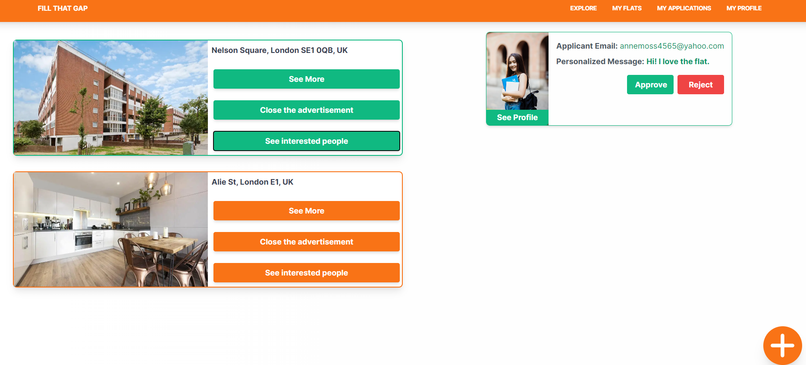
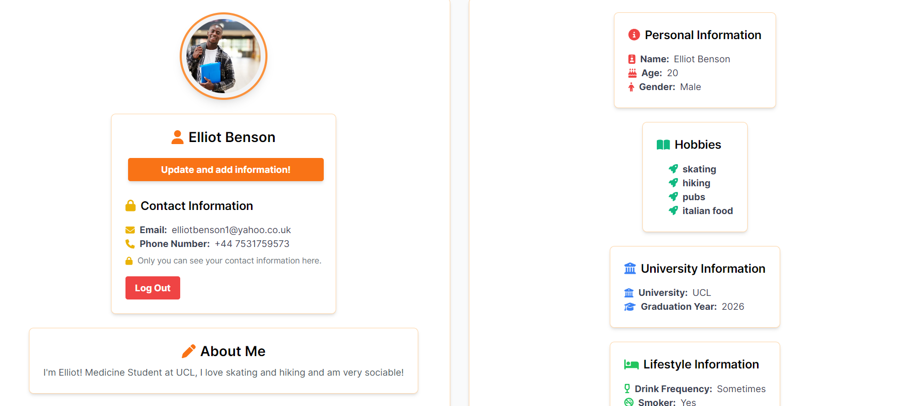
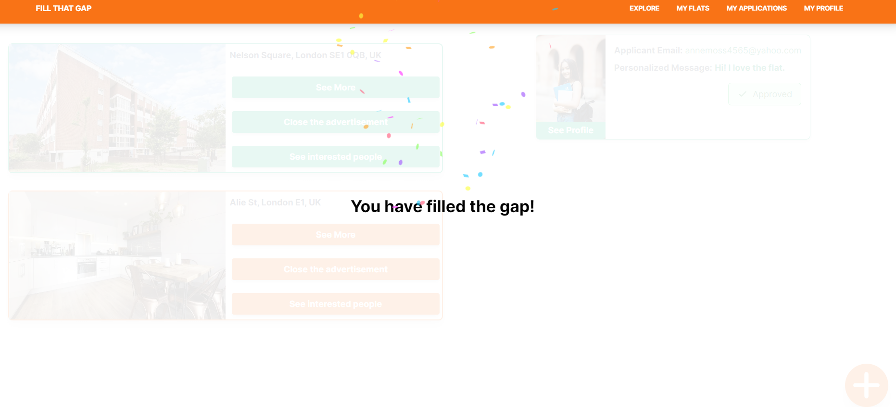
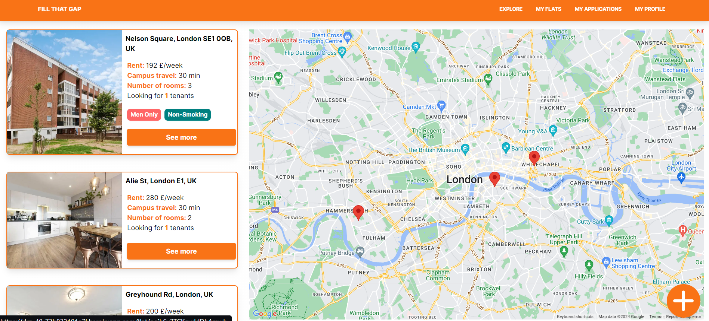
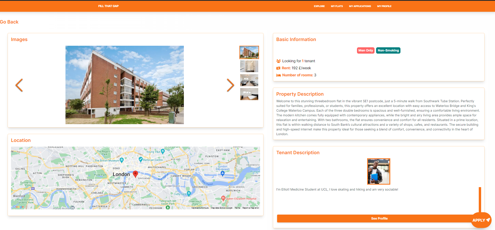

## Project Overview

- Module: COMP Designing For Real People
- Aims of the project:
    - Create a user driven solution
    - Interview potential users using human centered design techniques
    - Develop a digital touchpoint according to possible user stories

- Human centered design methods we used / learned:
    - Thin slice development
    - Prototyping and mockup development
    - Interviewing
    - Agile
    - Qualitative and quantitative data analysis

- Tech stack:
    - Node.js
    - React.js
    - Next.js
    - Typescript
    - Tailwind CSS
    - Firebase
    - Heroku
    - Docker

`Fill That Gap` is a solution for student renters enabeling them to connect to flats and flatmates, providing an easy and 
stress-free way to handle their private housing during university.

## Documents
- [HCD Portfolio](./assets/HCD_portfolio.pdf) - document discussing how we used HCD to develop the project.
- [Legal Document](./assets/DRP%20License%20Document.pdf) - document discussing legal side of the project

## Digital Touchpoint






## Starting the app

Run the development server:

```bash
npm run dev
```

Open [http://localhost:3000](http://localhost:3000) with your browser to see the result.

Create a `.env.local` file and fill the following fields with your API keys:
```bash
NEXT_PUBLIC_GOOGLE_MAPS_API_KEY=YOUR_KEY
NEXT_PUBLIC_FIREBASE_API_KEY=YOUR_KEY
NEXT_PUBLIC_FIREBASE_AUTH_DOMAIN=YOUR_KEY
NEXT_PUBLIC_FIREBASE_PROJECT_ID=YOUR_KEY
NEXT_PUBLIC_FIREBASE_STORAGE_BUCKET=YOUR_KEY
NEXT_PUBLIC_FIREBASE_MESSAGING_SENDER_ID=YOUR_KEY
NEXT_PUBLIC_FIREBASE_APP_ID=YOUR_KEY
```